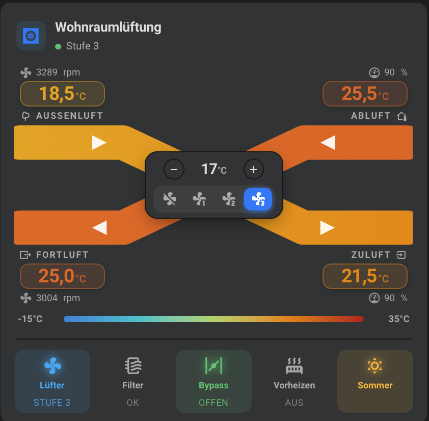
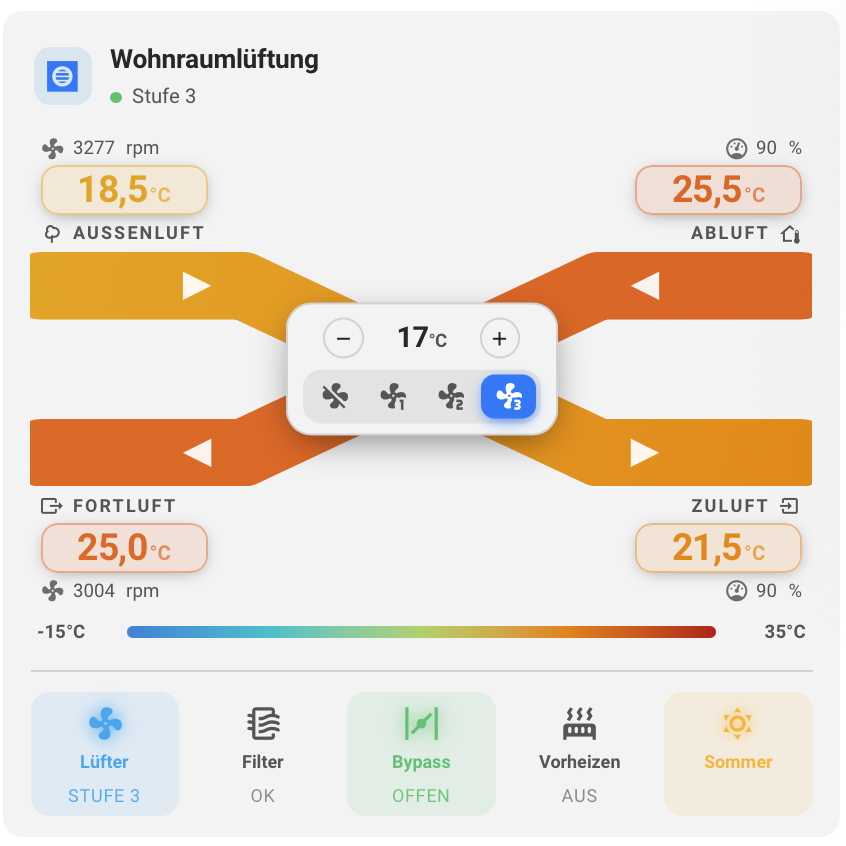
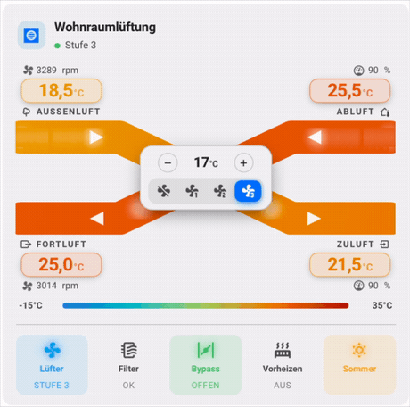
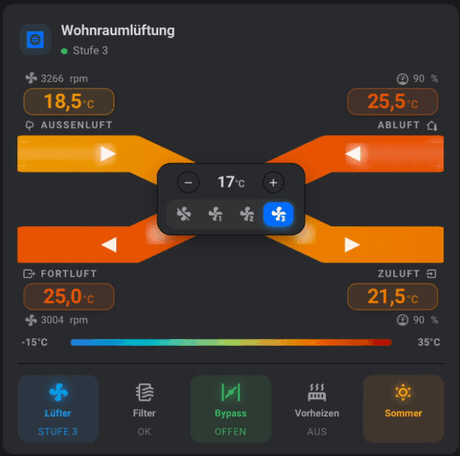
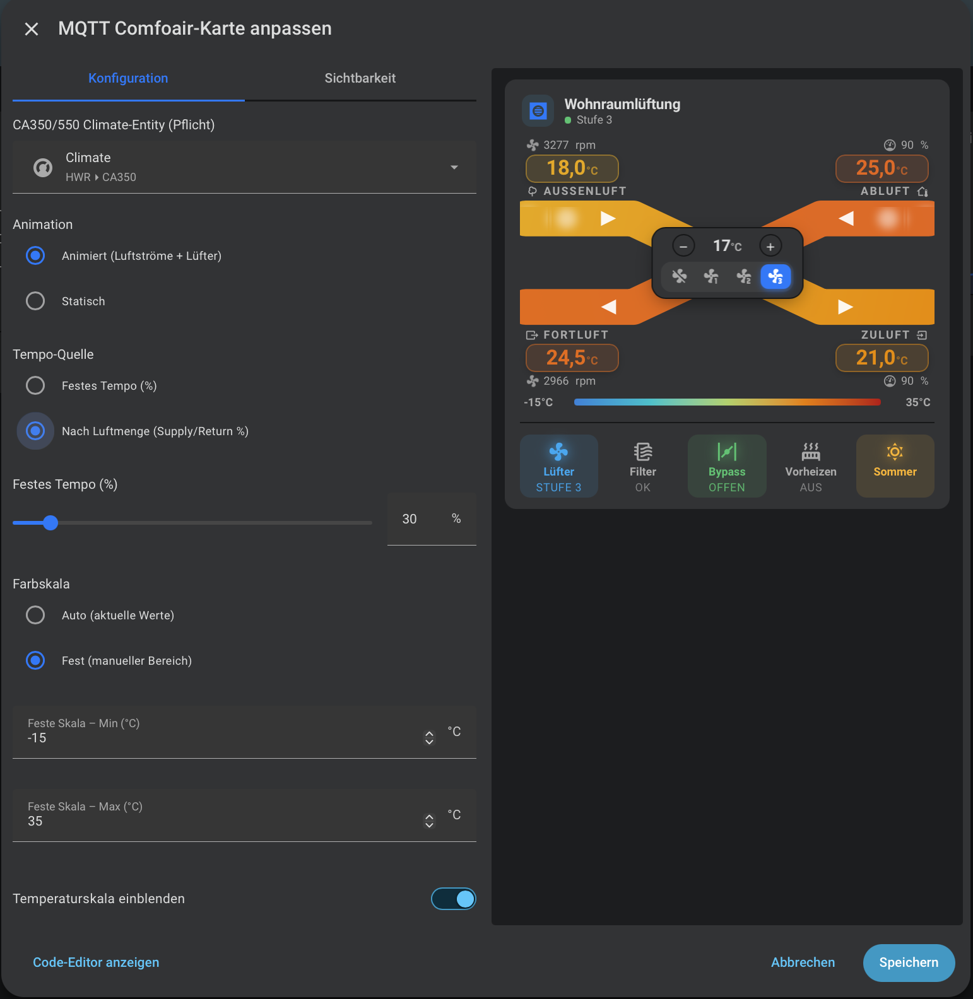

# Home Assistant Lovelace MQTT Comfoair Card

[](https://github.com/hacs/integration)
[](https://my.home-assistant.io/redirect/hacs_repository/?owner=TimWeyand&repository=lovelace-comfoair&category=frontend)

Lovelace-Karte zur Visualisierung und Steuerung einer **ComfoAir CA350/550** Lüftungsanlage,
angebunden über **[hacomfoairmqtt](https://github.com/adorobis/hacomfoairmqtt)** (adorobis) bzw. das
darauf basierende **comfoair2mqtt**-Add-on (MQTT Autodiscovery).



## Features

- **Ein-Klick-Konfiguration:** nur die climate-Entity wählen — alle Sensoren werden automatisch erkannt.
- Gekreuzte Luftströme (Außen-/Ab-/Fort-/Zuluft) mit **temperaturbasierter Farbskala** (OKLCH, Blau→Dunkelrot).
- **Wärmerückgewinnungs-%** live aus den Temperaturen berechnet.
- Sollwert-Steuerung (− / +) und Lüfterstufen (Aus / 1 / 2 / 3) mit hervorgehobener aktiver Stufe.
- Status-Leiste (Lüfter, Filter, Bypass, Vorheizen, Sommer/Winter) — beschriftet und farblich nach Zustand.
- **Statisch oder animiert** (Luftströme + rotierende Lüfter), Tempo fest **oder** an die Luftmenge gekoppelt.
- Optional einblendbare **Temperatur-Legende**.
- Klick auf einen Wert (Temperatur / Drehzahl / Luftmenge) öffnet den **Verlauf** (HA More-Info-Dialog).

## Galerie

| | Statisch (Standard) | Animiert (`animation: animated`) |
|---|---|---|
| **Hell** |  |  |
| **Dunkel** |  |  |

## Installation

### HACS (empfohlen)
Auf den Button oben klicken **oder** in HACS → *Custom repositories* dieses Repo als
Kategorie *Lovelace* hinzufügen, dann „MQTT Comfoair Card" installieren und das angebotene
Release wählen.

### Manuell
Das gebaute `comfoair-card.js` aus dem **[letzten Release](../../releases/latest)** laden
(es liegt bewusst **nicht** im Repo, sondern wird je Release gebaut) und nach
`config/www/lovelace-comfoair/comfoair-card.js` kopieren, dann als Ressource registrieren:
```yaml
url: /local/lovelace-comfoair/comfoair-card.js
type: module
```

## Konfiguration

1. Dashboard → Karte hinzufügen → „MQTT Comfoair Card".
2. **Nur die climate-Entity auswählen** (z. B. `climate.ca350_climate`) — die übrigen Entities
   werden automatisch erkannt. Unter „Erweitert / manuelle Zuordnung" überschreibbar.



### Optionen

| Option | Werte | Default | Beschreibung |
|--------|-------|---------|--------------|
| `entity` | climate-Entity | – | **Pflicht.** Die ComfoAir climate-Entity. |
| `name` | Text | „Wohnraumlüftung" | Titel im Kopf der Karte. |
| `animation` | `static` / `animated` | `static` | Animierte Luftströme + rotierende Lüfter. |
| `animation_speed_source` | `fixed` / `level` | `fixed` | Tempo fest (%) oder proportional zur Luftmenge (Supply/Return Air Level). |
| `animation_speed` | `10`–`200` (%) | `50` | Festes Tempo (nur bei `fixed`). 100 % = Basistempo. |
| `color_scale` | `auto` / `fixed` | `auto` | `auto` spreizt über die aktuellen vier Temperaturen; `fixed` nutzt `temp_min`/`temp_max`. |
| `temp_min` | °C | `-10` | Untere Grenze der festen Skala. |
| `temp_max` | °C | `30` | Obere Grenze der festen Skala. |
| `show_legend` | bool | `false` | Kleine Temperatur-Farbskala unten einblenden. |
| `tempSensor1..4`, `filterstatus`, `bypass_valve`, `summer_mode`, `preheat`, `fan_speed_supply`, `fan_speed_exhaust`, `return_air_level`, `supply_air_level` | Entity | auto-erkannt | Einzeln überschreibbar. |

### Performance
Im Default (`static`) läuft **keine** Animation — kein SMIL, keine CSS-Rotation. Die Karte
rendert nur neu, wenn sich eine der konfigurierten Entities ändert.

## Abwärtskompatibilität
Konfigurationen früherer Versionen funktionieren **unverändert** weiter — die Konfig-Schlüssel
sind gleich geblieben. Neue Optionen sind optional. Wer auf der alten Karte bleiben möchte,
kann in HACS gezielt die alte Version (`v0.15.0`) installiert lassen.

## Entwicklung & Release

```bash
npm install
npm run typecheck   # TypeScript (strict)
npm test            # Unit-Tests (Vitest)
npm run build       # erzeugt comfoair-card.js (nicht versioniert)
```

Releases laufen automatisch: Bei jedem Push auf `master` baut/testet die GitHub-Action und
erstellt ein Release inkl. angehängtem `comfoair-card.js`. Die Release-Version ist die
`version` aus `package.json` (Tag `vX.Y.Z`); existiert dieser Tag schon, wird automatisch die
**Patch**-Version erhöht. Für gezielte minor/major-Sprünge die `version` in `package.json` setzen.

## Hinweise
- Erwartet die von hacomfoairmqtt publizierten Entitäten (`…_outside/supply/return/exhaust_temperature`,
  `…_supply/return_air_level`, `…_supply/exhaust_fan_speed`, `binary_sensor.…_filter_status`/`_bypass_valve`/
  `_summer_mode`/`_preheating_status`). Der Geräte-Präfix (`ca350`, …) ist egal — erkannt wird primär über das HA-Gerät.
- **Voraussetzung:** Die `climate`-Entity muss von der Bridge publiziert werden — dafür in der
  Bridge-Konfiguration (`config.ini`) `HAEnableAutoDiscoveryClimate` aktivieren. Sie liefert die
  Lüfterstufen (off/low/medium/high) und den Sollwert (15–27 °C).
- Gilt auch für kompatible Geräte über dieselbe Bridge (StorkAir WHR930, Wernig G90-380, Paul Santos 370 DC).
